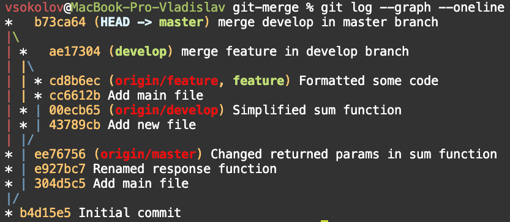
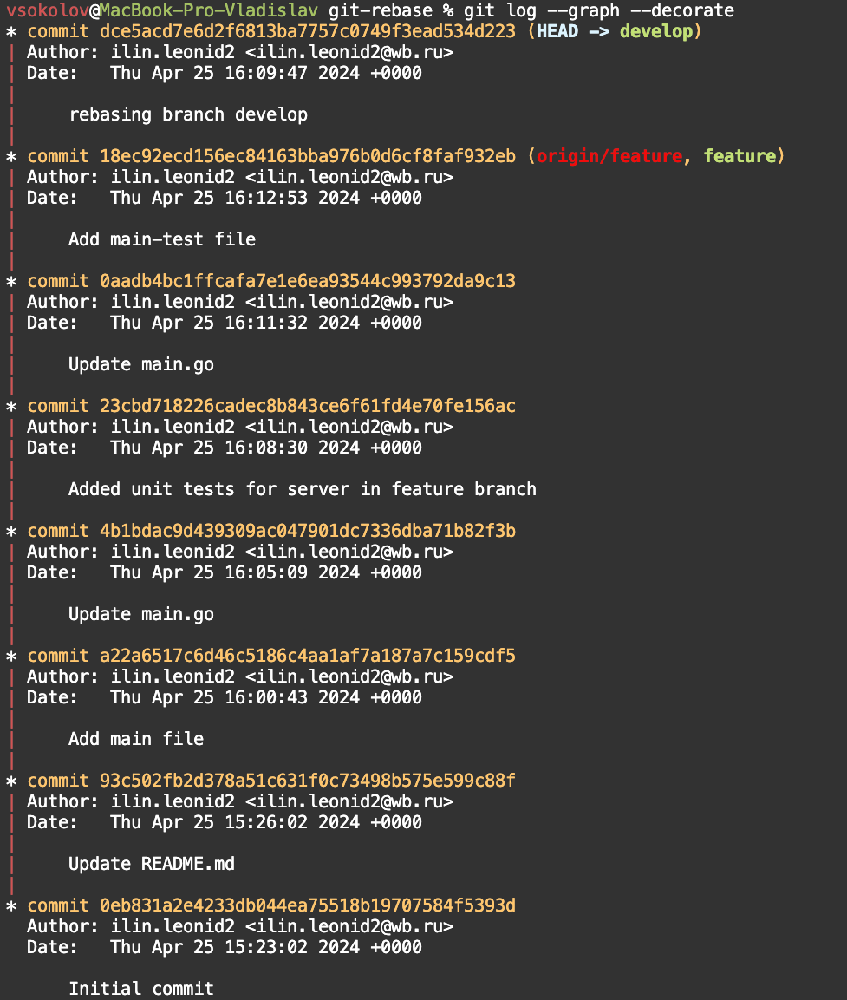
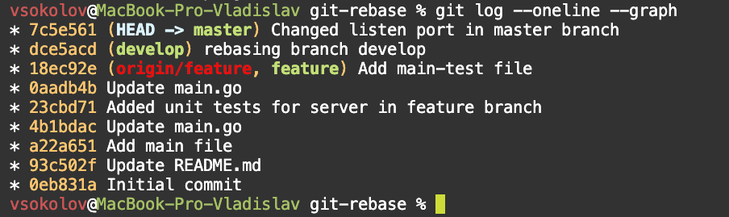
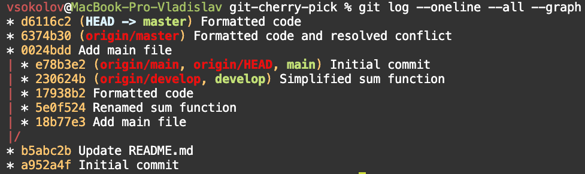

## 📂LESSON_1

В Этом репозитории находится шаблон дефолтного конфигурационного файла для Nginx. 
**[nginx.conf]**

## 🌐LESSON_2

  
— Ссылки на все репозитории:  
1. [orr-gitlab.wildberries](https://orr-gitlab.wildberries.ru/orr-onboarding/onboarding-vladislav-sokolov)  
2. [gitlab.wildberries.ru](https://gitlab.wildberries.ru/sokolov.v64/onboarding-vladislav-sokolov)  
3. [myPublic-gitlab](https://github.com/jonimuesli/Onboarding-Vladislav-Sokolov)  

— Краткое описание выполнения задания с «удаленным файлом»:

```bash
git-checkout % git log --oneline
2864fd9 (HEAD -> master, origin/master, origin/HEAD) Add file nginx.conf
dfbdad5 del file intitxt
e9dee85 Add new file
73ec3e7 add readmw.md
a1049c0 add tg
1b82ce2 add file mirror
6921b02 add curl.txt
vsokolov@MacBook-Pro-Vladislav git-checkout % git checkout dfbdad5
Note: switching to 'dfbdad5'.

You are in 'detached HEAD' state. You can look around, make experimental
changes and commit them, and you can discard any commits you make in this
state without impacting any branches by switching back to a branch.

If you want to create a new branch to retain commits you create, you may
do so (now or later) by using -c with the switch command. Example:

  git switch -c <new-branch-name>

Or undo this operation with:

  git switch -

Turn off this advice by setting config variable advice.detachedHead to false

HEAD is now at dfbdad5 del file intitxt
vsokolov@MacBook-Pro-Vladislav git-checkout % git log --oneline   
dfbdad5 (HEAD) del file intitxt
e9dee85 Add new file
73ec3e7 add readmw.md
a1049c0 add tg
1b82ce2 add file mirror
6921b02 add curl.txt
vsokolov@MacBook-Pro-Vladislav git-checkout % git show dfbdad5
commit dfbdad5677438fd4df16a838225126a8df1ec569 (HEAD)
Author: ilin.leonid2 <ilin.leonid2@wb.ru>
Date:   Sat Apr 20 14:44:18 2024 +0000

    del file intitxt

diff --git a/intitxt1.txt b/intitxt1.txt
deleted file mode 100644
index 4bbe4ab..0000000
--- a/intitxt1.txt
+++ /dev/null
@@ -1,6 +0,0 @@
-Совсем забыл рассказать про прикольную штуку из закона о применении ККТ. Они на законодательном уровне потребовали делать бекапы:
-
-Статья 4.5 пункт 2:
-"осуществлять резервирование базы фискальных данных и восстанавливать из резервных копий базу фискальных данных в случае их утраты;"
-
-Так что теперь не отвертишься, придется делать и тестировать бекапы 🙂
```

## 📝LESSON_3
_В данном уроке требуется «опробовать» разные «штуки», который поддерживает Markdown, мне кажется что я справился с данной задачей, если взглянуть на мой *README.md* документ в целом_ :relieved:

— Картинка:


— Таблица:  

| №   | Элемент         | Пример              |  
|-----|------------------|---------------------|  
| 1   | Заголовок        | `# Example`         |  
| 2   | Код              | ```python print()```|  
| 3   | Ссылка           | [empty](https://epmtyresources.empty)| 

## 🚫LESSON_4

— Добавление .gitignore:

_Содержание /tmp которое не попало в репозиторий(благодаря внесению файлов в *.gitignore*)_ 🙂

```ls -l
total 0
-rw-r--r--  1 vsokolov  staff  0 Jan 10 19:17 passwd.yaml
-rw-r--r--  1 vsokolov  staff  0 Jan 10 19:16 secret.yaml
vsokolov@MacBook-Pro-Vladislav tmp % pwd
/Users/vsokolov/Desktop/WB/git_lab/tmp
```

## 🌿LESSON_5
_Тут мы создаем две новые ветки и в каждой из них, меняем конфигурацию nginx.conf файла_

— Шаги:
```git branch front-new-site
git branch develop
git checkout develop
git branch
* develop
  front-new-site
  main

### В ветке develop меняем настройки в nginx.conf: 

+ worker_connections 16384; 

### В ветке front-new-site добавляем в файл nginx.conf:

+ client_body_buffer_size 16k; 
+ client_header_buffer_size 1k;
```
Итоговый [nginx.conf](./nginx.conf) со всеми изменениями.

## 🔗LESSON_6

— Описание:
После завершения работы в отдельных ветках обычно все изменения сливают в единую ветку, которую потом используют для обновления кода на серверах.

— Задание:
Объедините ветку develop с веткой master из предыдущего задания.
Загрузите изменения на gitlab.

— Шаги:
```vsokolov@MacBook-Pro-Vladislav git_lab % git checkout main
Switched to branch 'main'
Your branch is up to date with 'origin/main'.
vsokolov@MacBook-Pro-Vladislav git_lab % git branch
  develop
  front-new-site
* main
vsokolov@MacBook-Pro-Vladislav git_lab % git merge develop
Updating 3a4bba1..a42ae08
Fast-forward
 nginx.conf | 2 +-
 1 file changed, 1 insertion(+), 1 deletion(-)
vsokolov@MacBook-Pro-Vladislav git_lab % git status
On branch main
Your branch is ahead of 'origin/main' by 1 commit.
  (use "git push" to publish your local commits)

Untracked files:
  (use "git add <file>..." to include in what will be committed)
        README.md.back

nothing added to commit but untracked files present (use "git add" to track)
git push origin main
```

## ⚡LESSON_7

_Полезная команда:_
```git checkout <commit-hash> -- <file>```
Эта команда извлекает файл (<file>) из указанного коммита (<commit-hash>) и заменяет текущую версию этого файла на версию из этого коммита. Это полезно, если нужно вернуть файл в состояние, которое было в определённой точке истории, без необходимости переключаться на сам коммит или изменять другие файлы.

Пример:
```git checkout abc1234 -- index.html```
Эта команда восстановит файл index.html из коммита с хэшом abc1234


— Скриншот выполнения задания:



## 🛠️LESSON_8

— Скриншот выполнения задания:

Переместите коммиты из ветки feature в ветку develop с помощью rebase


Переместите коммиты из ветки develop в ветку master с помощью rebase


## 🍒LESSON_9

— Основные шаги:
```git cherry-pick 17938b2
Auto-merging main.go
CONFLICT (content): Merge conflict in main.go
error: could not apply 17938b2... Formatted code
hint: After resolving the conflicts, mark them with
hint: "git add/rm <pathspec>", then run
hint: "git cherry-pick --continue".
hint: You can instead skip this commit with "git cherry-pick --skip".
hint: To abort and get back to the state before "git cherry-pick",
hint: run "git cherry-pick --abort".

git-cherry-pick % git checkout 17938b2 -- main.go   
vsokolov@MacBook-Pro-Vladislav git-cherry-pick % git status                     
On branch master
Your branch is up to date with 'origin/master'.

You are currently cherry-picking commit 17938b2.
  (all conflicts fixed: run "git cherry-pick --continue")
  (use "git cherry-pick --skip" to skip this patch)
  (use "git cherry-pick --abort" to cancel the cherry-pick operation)

Changes to be committed:
        modified:   main.go

vsokolov@MacBook-Pro-Vladislav git-cherry-pick % git cherry-pick --continue

[master d6116c2] Formatted code
 Author: ilin.leonid2 <ilin.leonid2@wb.ru>
 Date: Thu Apr 25 18:04:15 2024 +0000
 1 file changed, 10 deletions(-)
```

— Скриншот выполнения задания:



## 🚀LESSON_10


